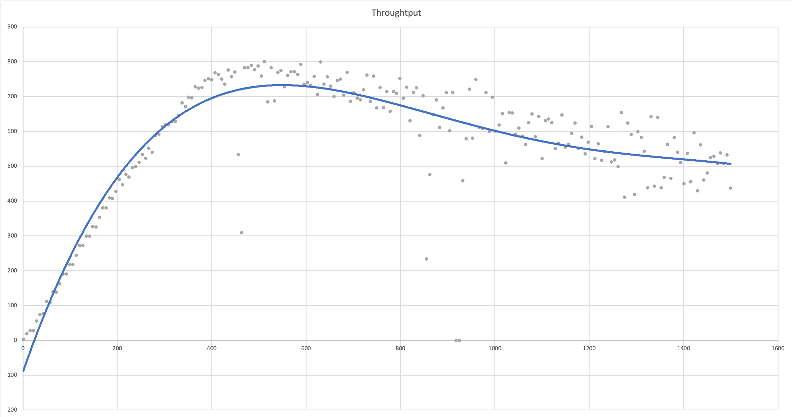
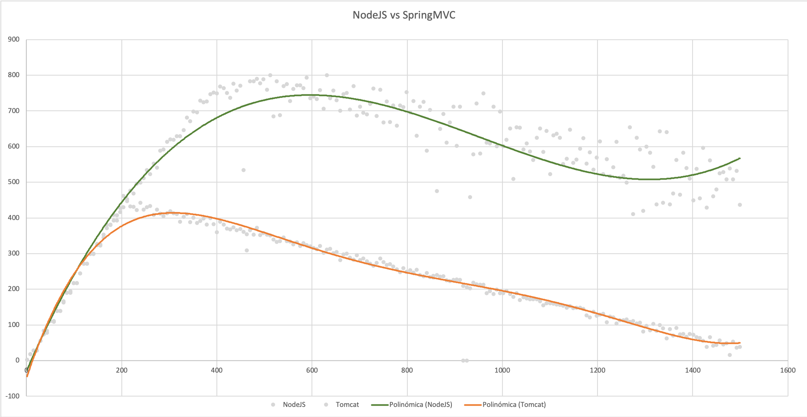

# Http-performance-analyzer (deprecated)
We are joining forces in a new initiative for distributed performance analysis. You can find more details in the repository: 
https://github.com/bancolombia/perf-analizer

## Explanation
This script is useful to find degration time of services that expose http endpoints. It consists in execute requests each n time varying concurrency in order to get throughtput info (TPS). With the results you are be able to build graphics like:  



You can find useful this script if you want to compare two frameworks with performance metrics. This is an example result of the comparation of NodeJS vs Spring Boot application.  



Internally we are using _Wrk_ tool to get each measuring point. 
https://github.com/wg/wrk


## Usage

You need to install _wrk_ tool:
```
brew install wrk
```

1. Open the file index.js and change the constant apiURL for the url of the service that you want to analyze. 
2. Install dependencies:
```
npm install
```

3. Start the service
```
npm start
```

4. Wait the test execution...

5. The resulting data will be in result.txt file. Each row corresponds to a measurement; the first one is the concurrency, and the second one is the TPS. 

5. Graph using a tool like Excel

### Parameters
This script has a few configurations:

**duration**: duration of each request of measuring. (3 seconds by default)
**iterations**: Quantity of executions (1600 by defualt)
**threads**: Quantity of threads used by Wrk for the benchmark
**initialIter**: initial concurrency


